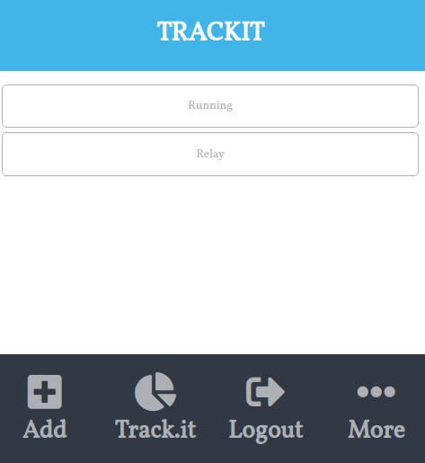

# Track IT 

This project works alongside the [backend repo](https://github.com/okikiola11/track-it) and contains the following requirements:

- The project is a mobile web app
- It uses Postgres as a database
- Ruby on Rails was used for the back-end and to create a REST API
- React was used for the front-end and uses redux to store the info across the app
- The project is deployed accessible online

## About

The projects consists of a tracking-app used to measure any routine you intend to pursue. You are able to:

- Sign in and Log in as a new user;
- Set your measures for the specific routine;
- Create a new set of counts.

## Live Demo

## [LiveVersion](https://trackit-app-react.herokuapp.com/)

## Built With

- React & Redux
- Javascript
- Ruby on Rails
- HTML, CSS, ESlint, stylelint

## Getting Started

To get a local copy up and running follow these simple example steps.

- Git clone https://github.com/okikiola11/track-it-frontend.git
- Move to the root directory in your command line
- run `npm install`
- run `npm start`

## Run test

To run the tests type this command line in the terminal

`npm test`

👤 **Apelehin Okikiola**

* Github: [@okikiola11](https://github.com/okikiola11)
* Twitter: [@Kikiolla3](https://twitter.com/Kikiolla3)
* LinkedIn: [@okikiola-apelehin](https://www.linkedin.com/in/okikiola-apelehin-459008122/)

## 🤝 Contributing

Contributions, issues, and feature requests are welcome!

## Show your support

Give a ⭐️ if you like this project!

## Acknowledgments

- To Microverse for their `README` template.
